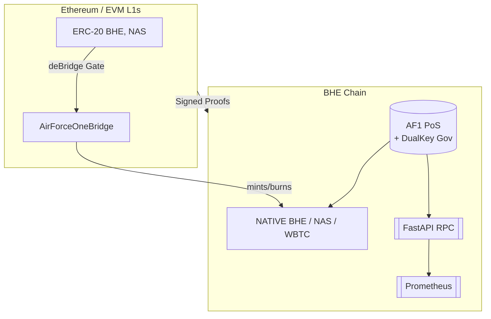

# BHE **Trustless** Blockchain Version – Comprehensive Specification & Implementation Plan

> **Status:** Draft v0.1 (2025‑04‑20)
>
> **Maintainers:** `@BHE‑core`, `@EXDEX‑devs`, `@SecurityOps`

---

## 1  Overview
The **Bitcoin Hardened Ethereum (BHE) Blockchain Version** elevates the existing BHE ecosystem from a token & service suite running on third‑party chains (Ethereum, Polygon, etc.) to a fully‑fledged, trustless L1/L2 hybrid chain governed by our *AF1* (AirForce One) protocols.

Key design‑points:
* **Trustless** – no central custodian keys; security anchored in cryptographic proofs, dual‑key governance, and strong economic incentives.
* **Bridge‑native** – seamless liquidity between BHE and external ecosystems via the **deBridge** SDK and the in‑house `AirForceOneBridge` contract.
* **Self‑hosting nodes** – *Every home is a node* philosophy, with cross‑platform installer, Banner Blocks Encryption, and Seritan Bug Aspect diagnostics.
* **Production‑ready** – built according to the principles of no temporary files, real‑world security, and high availability.

## 2  Background
The current BHE ecosystem offers:
1. **Wrapped BTC** (W‑BTC) on Ethereum.
2. **BHE Stakeholder Token** – non‑tradable, staking only.
3. **NAS Stablecoin** – tradeable, price‑stable.
4. **EXDEX** components (Pool, Shop, Opsec).

However, true sovereignty requires a dedicated chain. The **AF1 contract set** (already in `/AIRFORCE_ONE`) provides the foundation, but we must:
* Integrate deBridge for cross‑chain operations.
* Package node software for easy deployment.
* Extend RPC / API interfaces.
* Formalize documentation and DevOps.

## 3  Objectives
1. **Launch BHE chain Testnet v0.1** – 3 validators, 1 observer, 1 relayer.
2. **Bridge ready** – deposit / withdraw of BHE & NAS between Ethereum Goerli and BHE PrivateNet in <60 sec.
3. **Node install** – single‑command installer (`curl | bash`) for Linux/macOS/Win10 ×64.
4. **Security baseline** – Slither & Bandit scans with no critical findings.
5. **Docs live** – mkdocs site deployed to Netlify.

## 4  Architecture Summary

### 4.1  Consensus & Governance
* **`AirForceOnePool.sol`** – validator registry, staking & reward logic.
* **`The_Arbiter_Protocol.sol`** – dispute resolution & slashing.
* **Block time:** 2 sec ⌛, **finality:** ≤12 sec.

### 4.2  Bridge Mechanics
1. User locks ERC‑20 BHE on Ethereum via `deBridgeGate`.
2. Relayer submits proof to `AirForceOneBridge`.
3. Contract verifies, mints native BHE on BHE chain.
4. Reverse flow burns native BHE and unlocks on Ethereum.

### 4.3  Security Layers
* **Banner Blocks Encryption** – TLS‑like encryption for P2P traffic.
* **Seritan Bug Aspect** – ML bug detection; Windows‑specific insights.
* **Slither, MythX, Foundry Fuzzing** – CI enforced.

## 5  Smart Contract Inventory
| Contract | Purpose | Status |
|----------|---------|--------|
| `AirForceOneBridge.sol` | Bridge proof verification & mint/burn | Needs deBridge integration |
| `AirForceOnePool.sol` | Staking, validator set management | Ready – needs new tests |
| `The_Arbiter_Protocol.sol` | Slashing & dispute handling | Ready |
| `DualKeyContractSystem.sol` | Hot/cold key governance | Ready |
| `ContractEncryption.sol` | On‑chain obfuscation per Banner Blocks | Draft |
| `SecurityPassToken.sol` | Validator KYC token | Draft |

## 6  Node Software & RPC
* **Language:** Python 3.12 + FastAPI 0.110.
* **P2P Layer:** libp2p (Rust) bridged via FFI.
* **Commands:**
  * `bhe-node start --validator` – run validator node.
  * `bhe-node wallet bridge-deposit --amount 100 --asset BHE`.
  * `bhe-node rpc show-status`.
* **Prometheus** metrics at `/metrics` endpoint.

## 7  Development Roadmap
| Week | Goal | Key Tasks |
|------|------|----------|
| 1 | Contracts compile | Upgrade pragma to ^0.8.25, install OZ 5.x, add Foundry tests |
| 2 | Bridge integration | npm i `@debridge-finance/desdk`, implement proof verifier lib, Hardhat tests |
| 3 | Validator simulation | Docker compose network, Prometheus exporter, Grafana dash |
| 4 | RPC expansion | Endpoints: `/bridge/*`, `/consensus/peers`, `/debug/seritan` |
| 5 | Security hardening | Bandit, Slither, fuzzing 72h, remediate findings |
| 6 | Docs & Beta tag | mkdocs site, Netlify CI, announce Testnet v0.1 |

## 8  Detailed Deliverables
1. **`contracts/`** – all solidity sources + `hardhat.config.js` + Foundry project.
2. **`node/`** – Rust libp2p daemon, Python wrapper (`bhe_node.py`).
3. **`rpc_server/`** – FastAPI app, uvicorn entry.
4. **`docker/`** – `Dockerfile`, `docker-compose.yml` (3 validators + 1 relayer + Grafana).
5. **`scripts/`** – install, deploy, relayer helper.
6. **`docs/`** – mkdocs‑material site.

## 9  Tech Stack & Tooling
* **Solidity 0.8.25**, OpenZeppelin 5.x, deBridge SDK.
* **Hardhat 2.20**, Foundry `forge 0.2.x`.
* **Python 3.12**, `uv` dependency resolver.
* **Rust 1.78`** (libp2p daemon).
* **Docker 24.x**, **GitHub Actions**.

## 10  Testing & QA
1. **Unit:** Hardhat + Waffle.
2. **Property‑based:** Foundry invariant & fuzz.
3. **Integration:** Goerli ↔ PrivateNet via deBridge.
4. **E2E:** Docker network, simulated 10k tx/hour.
5. **Security:** Slither static, MythX dynamic, Bandit (Python), cargo‑audit (Rust).

## 11  Deployment
1. **Testnet** (Private): 3‑5 nodes on DigitalOcean, config via Ansible.
2. **Mainnet v1 Launch Criteria:** ≥50 validator sign‑ups, audit complete, bug bounty ≥4 weeks.

## 12  Documentation
* **User Guide:** wallet, staking, bridging.
* **Developer Guide:** contract APIs, RPC schema, run local node.
* **Architecture:** Mermaid diagrams: `BHE_Ecosystem_Architecture.mmd`, `BHE_Ecosystem_Flow.mmd` (update).

## 13  Acceptance Criteria
* 100% unit + integration tests pass in CI.
* Bridge transfer latency <60 sec (p95) on Goerli ↔ BHE Testnet.
* Consensus telemetry live & healthy for ≥48 h.
* Security audits show **no critical, no high** issues.
* Documentation site published & verified.

## 14  References & Links
* **AF1 Contracts Folder:** `/AIRFORCE_ONE` (current repo).
* **deBridge SDK:** <https://github.com/debridge-finance/desdk>.
* **BHE Main Repo:** this workspace.
* **EXDEX Components:** Pool/Shop/Opsec repos.

---
© 2025 BHE Core – Built under the *“Build For Real”* principle.
