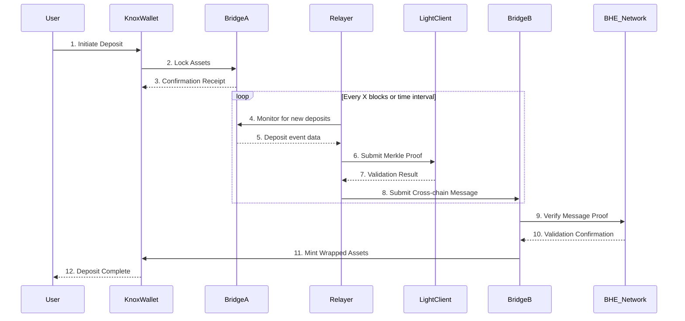

# Deposit & Bridge Workflow

## Workflow Steps

1. **User Initiation**: User initiates a deposit from their KnoxWallet
2. **Asset Locking**: Assets are locked in BridgeA's smart contract
3. **Receipt Generation**: User receives a deposit confirmation receipt
4. **Event Monitoring**: Relayer monitors BridgeA for deposit events
5. **Proof Submission**: Relayer submits Merkle proof to Light Client
6. **Cross-chain Message**: Validated message is sent to BridgeB
7. **Verification**: BridgeB verifies the message against BHE Network
8. **Asset Minting**: Wrapped assets are minted on BHE Network
9. **Completion**: User receives wrapped assets in their KnoxWallet

## Security Considerations
- All cross-chain messages are cryptographically verified
- Multiple confirmations required before finalizing transactions
- Economic incentives ensure relayers act honestly
- Light client verification ensures data integrity
