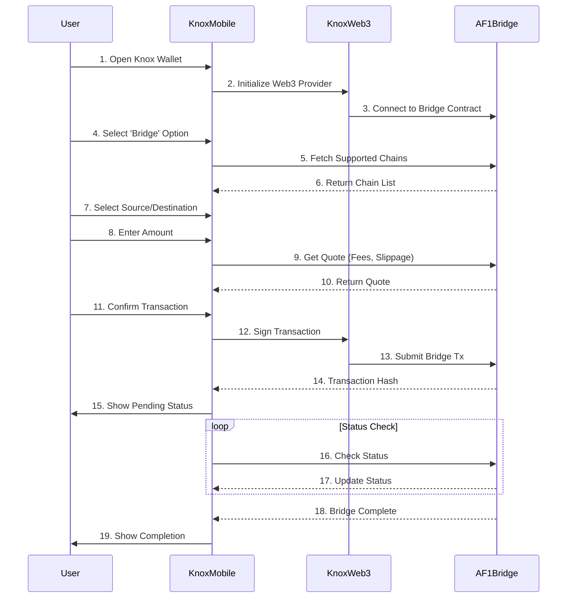

# Knox Wallet - AF1 Bridge Integration (Mobile & Web3 Only)

## Core Components
1. **Knox Wallet Mobile App**
   - React Native (iOS/Android)
   - Web3.js/Ethers.js integration
   - Secure key management

2. **AF1 Bridge Contracts**
   - AirForceOneBridge.sol
   - KnoxPool.sol
   - AF1Governance.sol

## Mobile-First Workflow



## Security Implementation

### Mobile App Security
- Biometric authentication
- Secure enclave for key storage
- No private key exposure to JS runtime

### Web3 Integration
- Direct RPC calls to AF1 nodes
- No third-party providers
- Hardware wallet support via Web3Modal

## Required Smart Contract Functions

```solidity
// AF1Bridge.sol
interface IAF1Bridge {
    function bridgeTokens(
        uint256 amount, 
        string calldata targetChain,
        uint256 serial
    ) external payable;
    
    function getBridgeQuote(
        address token,
        uint256 amount,
        string calldata targetChain
    ) external view returns (uint256 fee, uint256 minAmountOut);
    
    function getBridgeStatus(bytes32 txHash) 
        external 
        view 
        returns (BridgeStatus memory);
}
```

## Mobile Implementation

### React Native Bridge Module (Android)
```java
// KnoxBridgeModule.kt
@ReactModule(name = KnoxBridgeModule.NAME)
class KnoxBridgeModule(reactContext: ReactApplicationContext) : ReactContextBaseJavaModule(reactContext) {
    
    override fun getName() = "KnoxBridge"
    
    @ReactMethod
    fun initBridge(config: ReadableMap, promise: Promise) {
        // Initialize bridge with Knox security
    }
    
    @ReactMethod
    fun executeBridge(params: ReadableMap, promise: Promise) {
        // Handle bridge transaction with hardware security
    }
}
```

### iOS Implementation
```swift
// KnoxBridge.swift
@objc(KnoxBridge)
class KnoxBridge: NSObject {
    
    @objc(initBridge:resolver:rejecter:)
    func initBridge(config: [String: Any], 
                   resolve: @escaping RCTPromiseResolveBlock,
                   reject: @escaping RCTPromiseRejectBlock) {
        // Initialize with iOS Secure Enclave
    }
    
    @objc(executeBridge:resolver:rejecter:)
    func executeBridge(params: [String: Any],
                      resolve: @escaping RCTPromiseResolveBlock,
                      reject: @escaping RCTPromiseRejectBlock) {
        // Execute bridge transaction
    }
}
```

## Testing Matrix

| Test Case | Mobile | Web3 | AF1 Bridge |
|----------|--------|------|------------|
| Token Bridge | ✅ | ✅ | ✅ |
| Chain Selection | ✅ | ✅ | ✅ |
| Fee Calculation | ✅ | ✅ | ✅ |
| Transaction Signing | ✅ | ✅ | - |
| Status Tracking | ✅ | ✅ | ✅ |
| Error Handling | ✅ | ✅ | ✅ |

## Deployment Checklist

1. [ ] Deploy AF1 Bridge Contracts
2. [ ] Integrate Web3 in Knox Mobile
3. [ ] Implement Secure Bridge UI
4. [ ] Test Cross-Chain Transfers
5. [ ] Deploy Monitoring
6. [ ] Security Audit

This implementation ensures a secure, mobile-first bridge experience using only Knox Wallet's Web3 implementation without any third-party wallet dependencies.
