# Swap via ExDeX Router Workflow

```mermaid
sequenceDiagram
    participant User
    participant KnoxWallet
    participant ExDeX_Router
    participant Liquidity_Pool
    participant Price_Oracle
    participant Fee_Collector
    
    User->>KnoxWallet: 1. Initiate Swap (TokenA → TokenB)
    KnoxWallet->>ExDeX_Router: 2. Swap Request
    
    ExDeX_Router->>Price_Oracle: 3. Get Price Feed
    Price_Oracle-->>ExDeX_Router: 4. Current Exchange Rate
    
    ExDeX_Router->>Liquidity_Pool: 5. Check Available Liquidity
    Liquidity_Pool-->>ExDeX_Router: 6. Pool Reserves & Slippage Data
    
    ExDeX_Router->>ExDeX_Router: 7. Calculate Best Execution
    
    alt Sufficient Liquidity & Acceptable Slippage
        ExDeX_Router->>KnoxWallet: 8. Request Approval (if needed)
        KnoxWallet-->>ExDeX_Router: 9. Token Approval
        
        ExDeX_Router->>Liquidity_Pool: 10. Execute Swap
        Liquidity_Pool-->>ExDeX_Router: 11. Swap Confirmation
        
        ExDeX_Router->>Fee_Collector: 12. Distribute Protocol Fees
        ExDeX_Router->>KnoxWallet: 13. Send Received Tokens
        KnoxWallet-->>User: 14. Swap Complete
    else Insufficient Liquidity/High Slippage
        ExDeX_Router->>KnoxWallet: 8b. Revert with Error
        KnoxWallet-->>User: 9b. Swap Failed (Show Reason)
    end
```

## Workflow Steps

1. **Swap Initiation**: User selects tokens and amount in KnoxWallet
2. **Route Calculation**: ExDeX Router finds optimal swap path
3. **Price Check**: Verifies current market conditions
4. **Liquidity Check**: Ensures sufficient funds in target pool
5. **Execution**: If conditions met, swap is executed atomically
6. **Settlement**: Tokens are transferred, fees are collected

## Key Features
- **Optimal Routing**: Automatically finds best path through multiple pools
- **Slippage Protection**: Validates price impact before execution
- **Gas Efficiency**: Batches transactions when possible
- **MEV Protection**: Implements measures against front-running

## Security Measures
- Price oracle aggregation to prevent manipulation
- Deadline enforcement to prevent pending transactions
- Reentrancy protection in smart contracts
- Slippage tolerance settings to protect users
